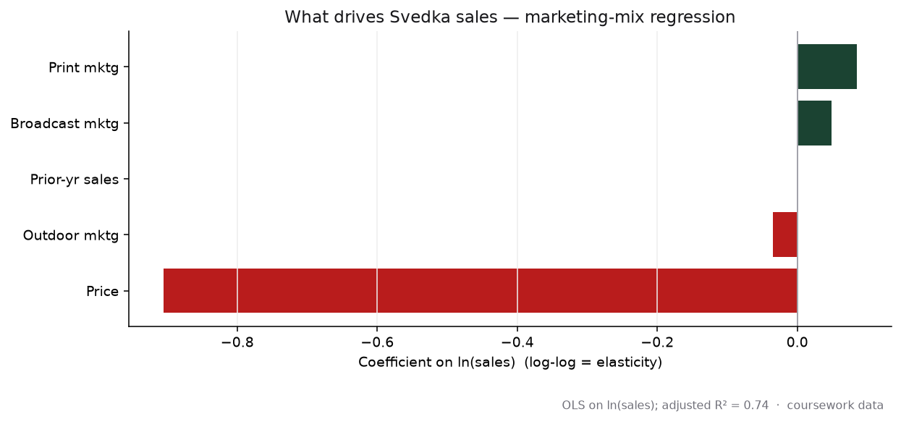

# SvedkaVodkaCase: What Moves Vodka Sales?

A brand-strategy and econometrics case on SVEDKA vodka: how positioning, pricing, and the marketing mix drive sales in a crowded category. Strategy questions are answered qualitatively; the sales drivers are quantified with regression.

## At a glance

| | |
|---|---|
| **Role** | Analyst (marketing analytics, econometrics) |
| **Stack** | R (linear regression), Excel |
| **Data** | SVEDKA case dataset, ~263 brand-year observations across the vodka category |
| **Context** | UC Riverside MSBA (MGT 251) |
| **Key result** | Log-log model explains **about 74%** of ln(sales) variance; price elasticity near **-0.9**, print marketing a positive driver |

## Problem & context

SVEDKA entered the market as an affordable premium vodka. This case asks two things: what strategy explains that positioning (market entry, roll-out, communication), and, quantitatively, what actually drives sales across the category, price, advertising, brand quality tiers, and competition.

## Approach

- **Strategy (Parts A and B):** analyzed the market gap, positioning statement, roll-out plan, and how the brand's communication evolved.
- **Econometrics (Part C):** built a sequence of OLS models on ln(sales):
  - `LnSales ~ LnPrice + LnPrint + LnOut + LnBroad + LagTotalSales`
  - then added brand-quality tiers, category competition (lag total minus own sales), and a first-introduction dummy.
- **Evaluation:** adjusted R-squared and coefficient signs/significance across the five models.

## Key findings

- **Price is the dominant driver and it is negative**, with an elasticity near -0.9: higher price meaningfully lowers sales.
- **Print marketing is a positive lever**, while outdoor and broadcast spend were weaker or not significant.
- The base model explains **~74% of ln(sales) variance** (adjusted R-squared 0.74); adding quality tiers, competition, and a first-intro flag improved the change-in-sales models.
- Together this points to disciplined pricing plus targeted print as the highest-leverage moves.

## Repo guide

- `RegressionAnalysis File.Rmd` / `Regression Analysis file.html`: the five regression models and outputs.
- `Detailed analysis.pdf`: written answers to the strategy questions.
- `Svedka Dataset.xlsx`: the case dataset (`data` sheet).
- `Svedka Vodka PPT Presentation.pdf`: slides.
- `assets/hero.png`: coefficient chart of the marketing-mix model (regenerated from the dataset).

**Reproduce:** open the `.Rmd` in RStudio and knit; it reads the `data` sheet and fits the models.

---

Tools: R · linear regression · marketing-mix modeling · Excel
Part of my portfolio → https://visheshshukla.netlify.app

_Team academic project (UC Riverside MSBA). Coursework data, shown for demonstration._
